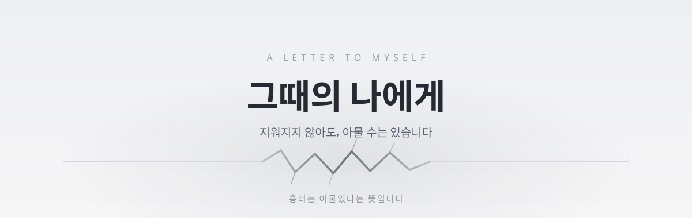

# 그때의 나에게

살아오며 받은 상처 중 아직 마음에 남아 있는 것을 골라, 하나씩 지금은 어떤지 돌아보고,
그 일들을 겪던 그때의 나에게 보내는 편지를 받는 웹 서비스.

상처의 순위를 매기지 않는다. "둘 중 어느 게 더 아팠나"는 묻지 않고, 고른 것을 하나씩 보여주며 지금은 어떤지만 묻는다. 아무것도 탈락하지 않고 모든 항목이 각자의 자리에 남는다.
서버와 DB 없이 동작하고 고른 내용은 어디로도 전송되지 않는다.

※ 이 서비스는 상담이나 치료를 대체하지 않음
자살예방 109 · 정신건강 1577-0199 · 여성긴급전화 1366 · 청소년 1388 · 범죄·학대 신고 112

## 흐름

| 화면 | 하는 일 |
| 랜딩 | 사전 안내, 도움 연락처 |
| 고르기 | 상처 156개(14개 영역) 중 5~10개 선택 |
| 돌아보기 | 하나씩 지금의 무게를 4단계로 표시, 건너뛰기 가능 |
| 지금의 나 | 그때는 없었지만 지금은 있는 것 34개 중 선택 |
| 결과 | 무게별 목록 + 편지 질문지 |

질문지를 AI 채팅 서비스에 붙여넣으면 편지가 온다.
선택 결과 외에 망설인 항목, 건너뛴 개수 같은 과정도 질문지에 담긴다.

## 스택

HTML
CSS
JavaScript

## 구조

index.html    5개 화면의 뼈대
data.js       상처 156개, 무게 4단계, 지금의 나 34개, 도움 연락처
prompt.js     기록을 편지 질문지로 만드는 함수
app.js        화면 전환, 선택 로직, 인터랙션 기록, 결과 계산
style.css     디자인